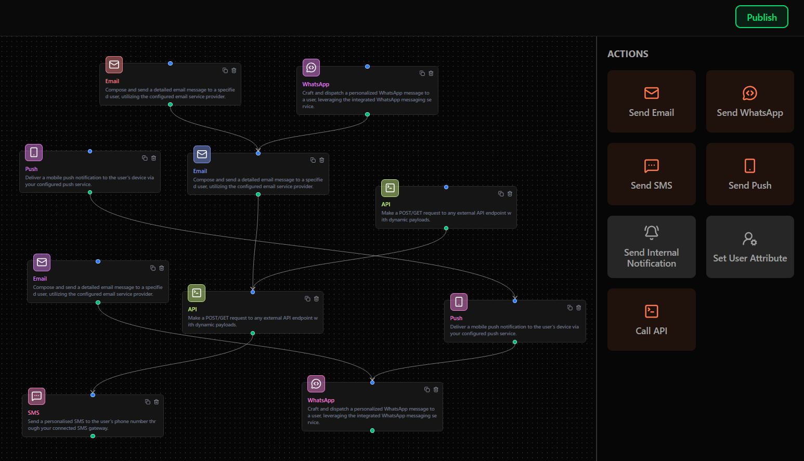

# Chatbot Flow Builder

A full-stack **Next.js 14** application for visually designing multi-step automation journeys (email, WhatsApp, SMS, …) using an interactive drag-and-drop canvas powered by **React-Flow**.



---

## ✨ Features

• **Drag-and-drop canvas** – add nodes (Email, WhatsApp, Condition, Wait, API, …) from the sidebar and connect them with smart handles.  
• **Single-source React-Flow state** – nodes/edges stored in global context, no duplicate local state.  
• **Custom node cards** – coloured icon, title, editable description, realtime status dot.  
• **Smart handles** – only one outgoing edge per source; unlimited incoming on targets; colour-coded.  
• **Resizable / animated sidebar** – Framer-Motion slides between _Actions_ grid and _Node Settings_ panel with staggered pop-in tiles.  
• **Dark / light theme** – Tailwind + shadcn palette, adaptive backgrounds and gradients.  
• **Publish validation** – warns if multiple dangling start/end nodes; toast feedback via Sonner.  
• **Header & Navbar** – blurred translucent bars, theme-aware gradients, fixed positioning.  

---

## 🚀 Quick Start

```bash
pnpm install # or npm / yarn
pnpm run dev
```

Visit http://localhost:3000

---

## 🗺️ Folder Structure

```
app/
  layout.tsx          – Global theme + toast provider
  page.tsx            – Landing page w/ radial gradient
  (main)/pages/
    workflow/         – Flow builder route
      _components/    – Canvas, sidebar, custom nodes, header …
components/
  global/             – Navbar component
  ui/                 – shadcn-ui primitives
lib/                  – types, constants, helpers
providers/            – Editor & Connections context
public/               – Static assets (banner2.png, icons …)
```

---

## 🔑 Key Scripts

| command            | description                       |
|--------------------|-----------------------------------|
| `pnpm run dev`     | start dev server                  |
| `pnpm run lint`    | eslint + unused-imports cleanup   |
| `pnpm run build`   | next build                        |

---

## 📸 Screenshots

| Light | Dark |
|-------|------|
|  |  |

---

## 📝 License

MIT © 2024
